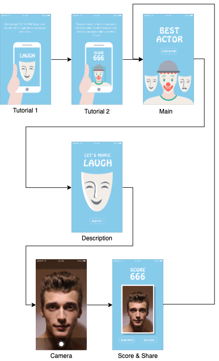
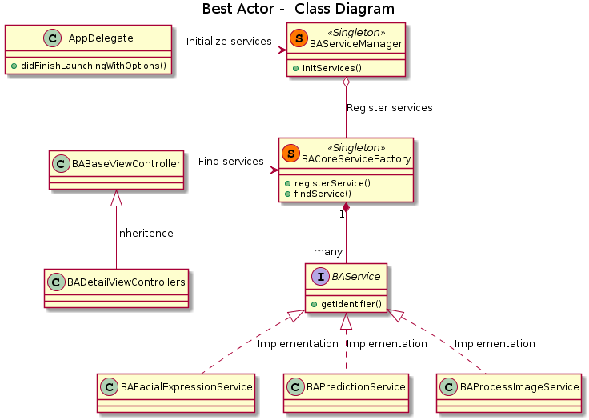

# Best Actor

## Abstract

Best Actor is a mobile game which uses computer vision to detect facial expressions. Specifically, the mobile game will randomly displays a facial expression label (e.g. surprise) to the player. And the player has to mimic the facial expression so as to achieve a high score. This document will discuss the design and implementation details of the mobile game.

## System Requirement

- iOS 12.0 or above
- Xcode 11 or above

## Design

### UI / UX

The UI / UX design of the mobile game is demonstrated below.

- When the app launches, there will be tutorial pages to guide the player how to play the game.
- Then the player will enter the main page, which shows the title of the game.
- When the player clicks to play the game, there will be a description of the facial expression that the player should mimic.
- Next, the front camera will be opened, and the player shall take a selfie to mimic the facial expression.
- Last but not least, the player can view the score which shows how well he can mimic the facial expression. Besides, the player may also choose to play the game again, or share the selfie with his friends.



### Technical

The class diagram of the mobile game is demonstrated as below.

- `BAServiceManager`: A manager class which will initialize the services. When the app launches through "didFinishLaunchingWithOptions" in "AppDelegate", it will register the instance of services to the service factory.
- `BACoreServiceFactory`: A factory class which allows to register services, or find services with identifiers.
- `BAService`: A protocol / interface which shall be implemented by the service class.
- `BAFacialExpressionService`: A service class which randomly loads facial expression labels stored in `plist` file.
- `BAPredictionService`: A service class which predicts the facial expression with computer vision.
- `BAProcessImageService`: A service class which processes the image captured from the device camera.
- `BABaseViewController`: A base / super view controller class which defines some generic UI (e.g. background color, etc.). It shall be inherited by other view controllers in the project.



## Installation

- Install the frameworks through CocoaPods

This mobile game uses TensorFlow Lite to make predictions with computer vision model. Therefore, execute the following command to install the frameworks through CocoaPods.

```
pod instal
```

- Run the mobile game through Xcode

Next, open the `BestActor.xcworkspace` in Xcode and run the mobile game. Since the mobile game requires camera access, it is highly suggested to run on the real iOS device instead of simulator.

## Conclusion

To put it in a nutshell, Best Actor is a mobile game which integrates the computer vision technology to detect facial expressions.